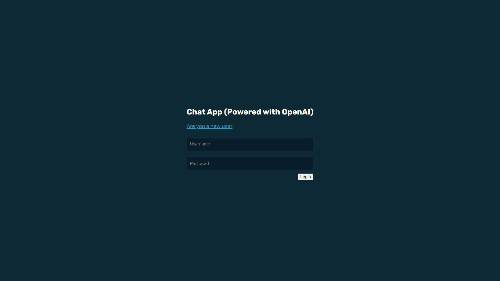
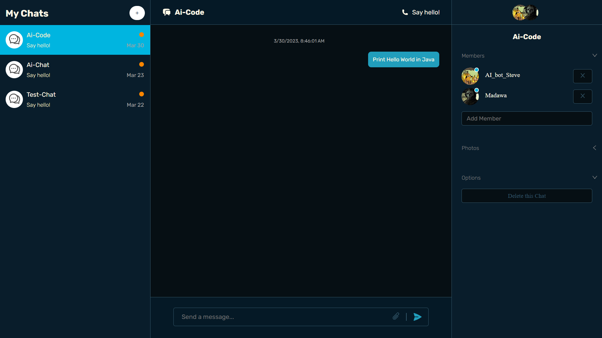

<h1 align="center">
 💬 Chat Application with ChatGPT API
</h1>
<p align="center">
Expressjs, React/Redux, Nodejs
</p>
<p align="center">
:octocat:
</p>

<p align="center">
   <a href="https://github.com/TerribleCodes/Chat_App_with_ChatGPT_API/blob/master/LICENSE.md">
      
   </a>
</p>

> This application uses ChatEngine, OpenAI and ChatGPT integration.The rontend uses ChatEngine and Redux toolkit for state management and Redux Toolkit Query for API calls and the backend uses NodeJS as the runtime environment and ExpressJS for the route handling.

## Clone the repository

```terminal
$ git clone https://github.com/TerribleCodes/Chat_App_with_ChatGPT_API.git
```

## Project structure

      CHAT_APP_WITH_CHATGPT_API
      ├── client
      │   ├── node_modules
      │   ├── public
      │   └── src
      │       ├── assets
      │       ├── components
      │       │   ├── chat
      │       │   ├── customHeader
      │       │   ├── customMessageForm
      │       │   └── login
      │       └── state
      ├── misc
      └── server
         │   ├── node_modules
         └── └── routes

# Usage (run fullstack app on your machine)

## Prerequisites

- [NodeJS](https://nodejs.org/en/download/)
- [npm](https://nodejs.org/en/download/package-manager/)

_Notice, you need client and server runs concurrently in different terminal session, in order to make them talk to each other_

## Client-side usage

### Client-side environmental variables

| Name            | Description                                                       | Default Value |
| --------------- | ----------------------------------------------------------------- | ------------- |
| PORT            | Port Number                                                       | 1337          |
| VITE_PROJECT_ID | [Project ID](https://chatengine.io/docs/react/v1/getting_started) | -             |
| BOT_USER_NAME   | [Users](https://rest.chatengine.io/#intro)                        | AI_bot_Steve  |
| BOT_USER_SECRET | [User Password](https://rest.chatengine.io/#intro)                | 1234          |
| OPEN_API_KEY    | [Project ID](https://chatengine.io/docs/react/v1/getting_started) | -             |

### Run the server side

```terminal
$ cd client          // go to client folder
$ npm i    // npm install packages
$ npm run dev        // run it locally
```

## Server-side usage

### Server-side environmental variables

| Name            | Description                                                       | Default Value         |
| --------------- | ----------------------------------------------------------------- | --------------------- |
| VITE_BASE_URL   | URL to the locally running instance                               | http://localhost:1337 |
| VITE_PROJECT_ID | [Project ID](https://chatengine.io/docs/react/v1/getting_started) | -                     |

### Run the client side

```terminal
$ cd server   // go to server folder
$ npm i       // npm install packages
$ npm run dev // run it locally
```

# Dependencies (tech-stacks)

| Client-side                         | Server-side          |
| ----------------------------------- | -------------------- |
| react: ^18.2.0                      | axios: ^1.3.4        |
| @heroicons/react: ^2.0.16           | body-parser: ^1.20.2 |
| @reduxjs/toolkit: ^1.9.2            | cors: ^2.8.5         |
| react-chat-engine-advanced: ^0.1.28 | dotenv: ^16.0.3      |
| react-dom: ^18.2.0                  | express: ^4.18.2     |
| react-dropzone: ^14.2.3             | helmet: ^6.0.1       |
| react-redux: ^8.0.5                 | morgan: ^1.10.0      |
| react-router-dom: ^6.8.1            | openai: ^3.2.1       |

# Screenshots of this project

Login Page/ Register Page


Chat UI


## Bugs or comments

[Create new Issues](https://github.com/TerribleCodes/Chat_App_with_ChatGPT_API/issues)

---

<p align="right">
   <a href="https://www.youtube.com/watch?v=ffEDkqfIzxM">
     <i>This project was based on the tutorial - Build a Chat App with NEW ChatGPT API by Ed-Roh</i>
   </a>
</p>
